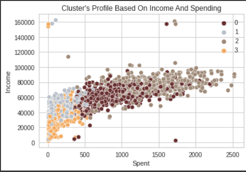
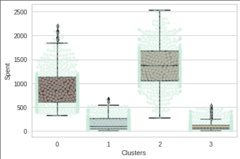
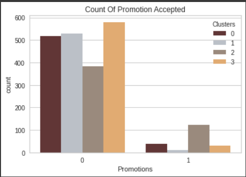
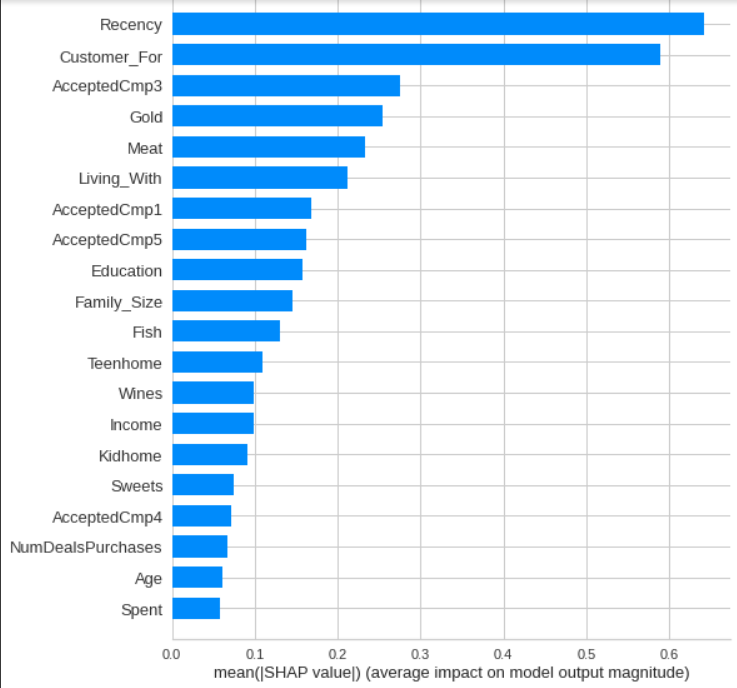

# Customer-Personality-Analysis
Analysis of company's ideal customers

Q1. Income vs spending plot shows the clusters pattern

Cluster 0: average spending & average income

Cluster 1: low spending & average income

Cluster 2: high spending & high income

Cluster 3: low spending & low income

From the above plot, it can be seen that Cluster 2 is our biggest set of customers followed by Cluster 0. So, Cluster 2 is spending the highest on & Cluster 0 is spending the second highest. So, company can focus accordingly for making the marketing strategies.

Q2. Based on the below graph, we can infer that Cluster 0 & Cluster 2 customers will accept the offers in the next campiagn, as Cluster 0 & 2 customers have participated in all the campiagns so far. So, for target audience, the company must focus on Cluster 0 & 2.

From SHAP analysis, we infer that Recency, i.e. Number of days since customer's last purchase, has a very high impact on the next campiagn. Moreover, Martial_Status (Living_with) also has a higher impact on the campiagn results. Also, AcceptedCmp3 has a high impact on the next campiagn.

